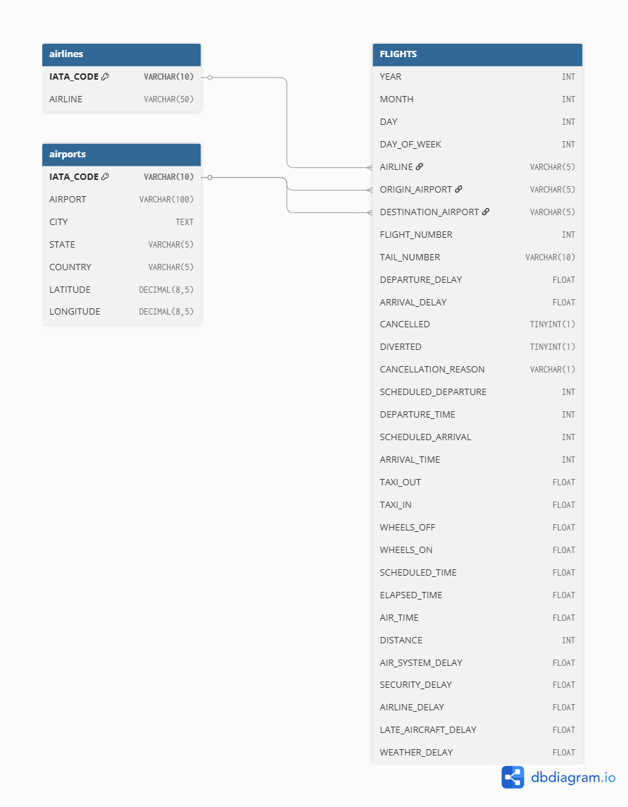

# us-flight-delay-sql-analysis
SQL analysis of 500K US domestic flights (2015) revealing counterintuitive findings — Spirit Airlines ranks last overall yet has the industry's second-lowest controllable delay. Built with Python for data preprocessing and MySQL for multi-table analysis using window functions, joins, and aggregations.

## Business Problem

Flight delays cost the US airline industry and economy between $30 and $34 billion annually. Airlines' operations and planning teams urgently need data-driven insights to distinguish between controllable delays—which they can address through scheduling and resource allocation—and structural delays driven by weather and airport congestion. This project analyzes 500,000 US domestic flights from 2015 using SQL to decompose delay patterns by airline, revealing which carriers truly manage their operations effectively versus those that simply benefit from favorable circumstances. The most striking discovery: Spirit Airlines, widely perceived as the industry's worst performer overall, actually has the second-lowest controllable delay rate—suggesting that reputation and operational reality may diverge when delays are properly categorized.

## Dataset 
**Source:** Kaggle — 2015 Flight Delays and Cancellations Volume: Original 5.8M rows, sampled 500K for analysis 

**Tables: 3 —** airlines (14 rows), airports (322 rows), flights (500K rows)
Sampling enabled faster SQL iteration and query optimization during development while preserving statistical representativeness across all carriers, routes, and seasons.
Analysis focuses on departure and arrival delays, airline-controllable vs. weather-driven delays, route performance, seasonal patterns, and cancellation root causes.

